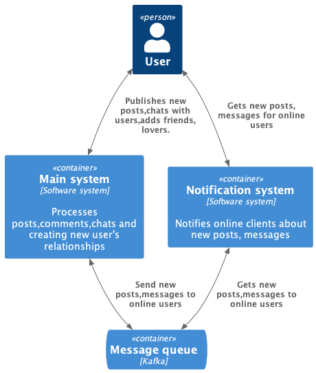
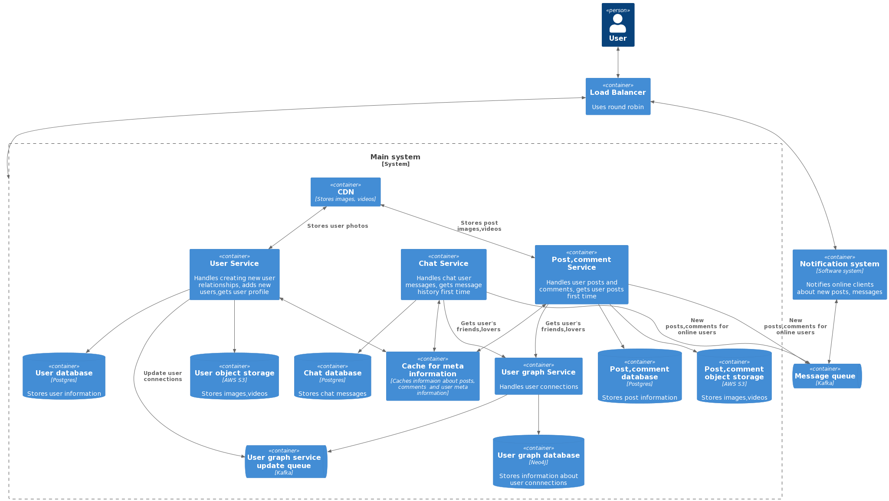
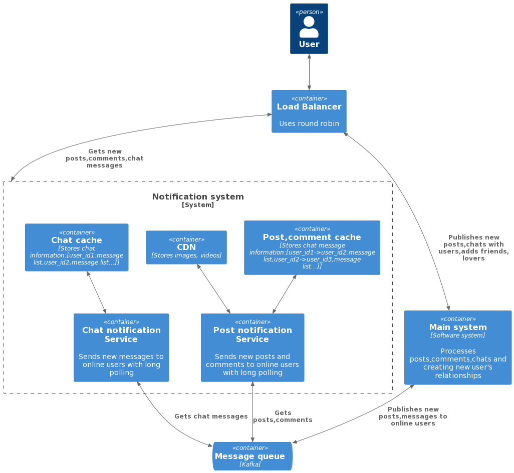

 # Social network - System Design
 
 Example of the homework for [System design course].
  
 ### Functional requirements:

 - User is able to add or remove users as friends, lovers and followers
 - User is able to publish or read posts
 - User is able to comment only posts of his friends,lovers and followers
 - User is able to add hashtags to own posts
 - User is able to like or dislike posts
 - User is able to send messages to other users if they are friends,lovers and followers 
 - Posts may contain text, images, audio and short videos
 - Messages may contain only text

 ### Non-functional requirements:

 - DAU 100 000 000 unique users
 - Availability is 99.95%
 - System favors availability over consistency
 - User may publish 10 new posts,comments per day
 - User may read posts,comments 20 times per day 
 - User may have 200 friends,lovers and followers
 - Message may contain 500 chars
 - Post may contain 2000 chars
 - Post may contain either one image,one audio or one video,
 - Image may be 1 MB
 - Video may be 10 MB
 - Audio may be 200 kB
 - If user publishes new post and comments,it will be shown for him in 3 seconds
 - User is able to see posts of his friends,lovers and followers in 5 seconds
 - Store user's posts,comments and messages for 5 years
 - geo distribution is not needed
 - No seasonality

 ## Design overview

 In order to design social network I've used [C4 model](https://c4model.com/). For up-front design sessions as well 
 as for documentation of existing systems, the C4 model was created to help describe software architecture.
 In other words, it's a way to map out your code, at various levels of detail.

 

     <b>Level 1.</b> System context diagram  
 

 

  
 

 

     <b>Level 2.</b> Main system container diagram  
 

 
 

    
 

 

     <b>Level 2.</b> Notification system container diagram  
 
 

 

    
 

 ## Back-of-the-envelope estimates

 - RPS (write) = 1000000000 / 86400 = 11574
 - RPS (read) = 2000000000 / 86400 = 23148 
 - Bandwidth (write) = 100000000 * 10 * (4000 + 10000000) // 86400 = 115 GB/s
 - Bandwidth (read) =  100000000 * 20 * (4000 + 10000000) // 86400 = 230 GB/s  
   (Assume 1 char takes 2 bytes,we don't count replication) 
 - Need 100000000 * 10 * (4000 + 1000000 + 10000000 + 200000 + 1000) = 11 PTB * 365 * 5 = 20075 PTB for 5 years.
 - Assume SSD speed(writing) is 300 MB/s and it needs to support the 230 GB/s, 
   we need to get about 1149 SSD with replication factor 3.

